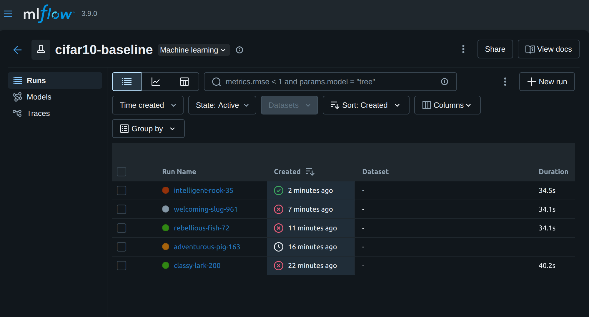

План действий
Написать Python-скрипт обучения с логированием в MLflow.

Собрать Docker-образ с этим скриптом.

Запустить обучение как Kubernetes Job.

После успешного завершения скопировать run_id из логов и создать InferenceService в KServe, указав URI модели из MLflow.

Проверить логи в MLflow UI и протестировать модель через curl.

Шаг 1. Скрипт обучения (train.py)
Создайте файл ~/mlops-infra/baseline/train.py:

python
import mlflow
import tensorflow as tf
from tensorflow.keras import layers, models
import numpy as np
import os

def main():
    # Параметры (можно передавать через переменные окружения)
    epochs = int(os.getenv("EPOCHS", "5"))
    batch_size = int(os.getenv("BATCH_SIZE", "64"))
    
    # Настройка MLflow (адрес сервера внутри кластера)
    mlflow.set_tracking_uri("http://mlflow-server.mlflow-system.svc.cluster.local:5000")
    mlflow.set_experiment("cifar10-baseline")
    
    # Загрузка данных
    (x_train, y_train), (x_test, y_test) = tf.keras.datasets.cifar10.load_data()
    x_train = x_train.astype('float32') / 255.0
    x_test = x_test.astype('float32') / 255.0
    y_train = tf.keras.utils.to_categorical(y_train, 10)
    y_test = tf.keras.utils.to_categorical(y_test, 10)
    
    # Модель CNN (базовая)
    model = models.Sequential([
        layers.Conv2D(32, (3,3), activation='relu', input_shape=(32,32,3)),
        layers.MaxPooling2D((2,2)),
        layers.Conv2D(64, (3,3), activation='relu'),
        layers.MaxPooling2D((2,2)),
        layers.Conv2D(64, (3,3), activation='relu'),
        layers.Flatten(),
        layers.Dense(64, activation='relu'),
        layers.Dense(10, activation='softmax')
    ])
    
    model.compile(optimizer='adam',
                  loss='categorical_crossentropy',
                  metrics=['accuracy'])
    
    # Запуск MLflow run
    with mlflow.start_run() as run:
        run_id = run.info.run_id
        print(f"MLflow Run ID: {run_id}")
        
        # Логирование параметров
        mlflow.log_param("epochs", epochs)
        mlflow.log_param("batch_size", batch_size)
        mlflow.log_param("dataset", "CIFAR-10")
        mlflow.log_param("model_type", "CNN")
        
        # Обучение
        history = model.fit(x_train, y_train,
                            epochs=epochs,
                            batch_size=batch_size,
                            validation_split=0.2,
                            verbose=2)
        
        # Оценка
        test_loss, test_acc = model.evaluate(x_test, y_test, verbose=0)
        mlflow.log_metric("test_accuracy", test_acc)
        mlflow.log_metric("test_loss", test_loss)
        
        # Сохранение модели в MLflow (как артефакт)
        mlflow.tensorflow.log_model(model, "model",
                                   registered_model_name="cifar10-cnn-baseline")
        
        # Сохраняем run_id в файл (для следующего шага)
        with open("/tmp/run_id.txt", "w") as f:
            f.write(run_id)
        
        print("Обучение завершено. Модель сохранена.")

if __name__ == "__main__":
    main()
Шаг 2. Dockerfile
Создайте ~/mlops-infra/baseline/Dockerfile:

dockerfile
FROM tensorflow/tensorflow:2.13.0
RUN pip install mlflow==2.9.0
COPY train.py /train.py
ENTRYPOINT ["python", "/train.py"]
Шаг 3. Сборка образа
Переключитесь на docker-демон Minikube, чтобы образ был доступен в кластере:

bash
eval $(minikube docker-env)
cd ~/mlops-infra/baseline
docker build -t cifar10-train:latest .
Шаг 4. Запуск обучения как Kubernetes Job
Создайте файл ~/mlops-infra/baseline/train-job.yaml:

yaml
apiVersion: batch/v1
kind: Job
metadata:
  name: cifar10-train-job
  namespace: default  # или можно в kubeflow-pipelines, но не обязательно
spec:
  template:
    spec:
      containers:
      - name: trainer
        image: cifar10-train:latest
        env:
        - name: EPOCHS
          value: "5"
        - name: BATCH_SIZE
          value: "64"
        - name: MLFLOW_TRACKING_URI
          value: "http://mlflow-server.mlflow-system.svc.cluster.local:5000"
        - name: AWS_ACCESS_KEY_ID
          value: minioadmin
        - name: AWS_SECRET_ACCESS_KEY
          value: minioadmin
        - name: MLFLOW_S3_ENDPOINT_URL
          value: "http://minio.mlflow-system.svc.cluster.local:9000"
      restartPolicy: Never
  backoffLimit: 2
Запустите Job:

bash
kubectl apply -f ~/mlops-infra/baseline/train-job.yaml
Шаг 5. Получение run_id
Дождитесь завершения Job:

bash
kubectl wait --for=condition=complete job/cifar10-train-job --timeout=600s
Посмотрите логи и найдите run_id:

bash
kubectl logs job/cifar10-train-job | grep "MLflow Run ID"
Запишите run_id (например, abc123...).

Шаг 6. Деплой модели в KServe
Убедитесь, что в namespace kserve есть секрет с доступом к MinIO (если нет, создайте):

bash
kubectl create secret generic minio-secret \
  --from-literal=AWS_ACCESS_KEY_ID=minioadmin \
  --from-literal=AWS_SECRET_ACCESS_KEY=minioadmin \
  -n kserve
Теперь создайте InferenceService, указав URI модели из MLflow. URI имеет вид:
s3://mlflow/<run_id>/artifacts/model

Создайте файл ~/mlops-infra/baseline/inferenceservice.yaml (замените <RUN_ID> на реальный):

yaml
apiVersion: serving.kserve.io/v1beta1
kind: InferenceService
metadata:
  name: cifar10-cnn-baseline
  namespace: kserve
  annotations:
    serving.kserve.io/s3-endpoint: "minio.mlflow-system.svc.cluster.local:9000"
    serving.kserve.io/s3-usehttps: "0"
spec:
  predictor:
    serviceAccountName: default
    tensorflow:
      storageUri: "s3://mlflow/0/<RUN_ID>/artifacts/model"
      env:
      - name: AWS_ACCESS_KEY_ID
        valueFrom:
          secretKeyRef:
            name: minio-secret
            key: AWS_ACCESS_KEY_ID
      - name: AWS_SECRET_ACCESS_KEY
        valueFrom:
          secretKeyRef:
            name: minio-secret
            key: AWS_SECRET_ACCESS_KEY
Примените:

bash
kubectl apply -f ~/mlops-infra/baseline/inferenceservice.yaml
Проверьте статус:

bash
kubectl get inferenceservice -n kserve
Модель должна перейти в состояние READY=True.

Шаг 7. Проверка в MLflow UI
Откройте MLflow (http://localhost:5000) и найдите эксперимент cifar10-baseline. Там должен быть run с вашими параметрами и моделью.

Шаг 8. Тестирование модели
Убедитесь, что у вас открыт порт для Istio Ingress (скрипт access-all.sh делает это). Затем выполните тестовый запрос:

bash
# Создадим JSON с одним изображением (3x32x32) с нормализованными значениями (0..1)
cat > /tmp/input.json << EOF
{
  "instances": [[[[0.1,0.2,0.3], [0.4,0.5,0.6], [0.7,0.8,0.9]] * 3] * 32]
}
EOF

# Отправляем запрос
curl -H "Host: cifar10-cnn-baseline.kserve.example.com" \
  http://localhost:8080/v1/models/cifar10-cnn-baseline:predict \
  -d @/tmp/input.json
Должен вернуться JSON с предсказанием (массив из 10 вероятностей).

Итог
Вы создали базовую конфигурацию без каких-либо "гейтов" (проверок, безопасности, мониторинга). Все шаги выполнены вручную, но их можно автоматизировать (например, в простом скрипте). Теперь это ваша точка отсчета для сравнения с защищенными конфигурациями.

Почему этот подход проще, чем KFP
Не требует установки и изучения KFP SDK.

Использует уже работающие компоненты (MLflow, KServe).

Легко отлаживать (логи Job, прямой доступ к MLflow).

Можно запустить несколько раз, меняя параметры.

Если в будущем понадобится оркестрация сложных пайплайнов, KFP пригодится. Но для Baseline достаточно Job.

Реализация задания "Нулевая конфигурация" (Baseline) для CIFAR-10
Как мы разрабатывали и выполняли задание
1. Подготовка инфраструктуры
Развернули локальный Kubernetes-кластер с помощью Minikube.

Установили ключевые компоненты:

Istio – сервисная сетка для управления трафиком (необходима для KServe).

KServe – платформа для сервинга моделей.

MLflow – трекинг экспериментов, метаданные в PostgreSQL, артефакты в MinIO.

MinIO – S3-совместимое хранилище для артефактов моделей.

cert-manager – для автоматического управления сертификатами (требуется KServe).

Проблема: Istio блокировал запросы к MLflow API (ошибка 403 из-за проверки заголовка Host).
Решение: Отключили sidecar-контейнер Istio для пода MLflow через аннотацию sidecar.istio.io/inject: "false" и добавили переменную SERVER_NAME в deployment MLflow. После перезапуска пода API стал доступен.

2. Разработка кода обучения
Написали скрипт train.py на TensorFlow для обучения свёрточной нейронной сети (CNN) на датасете CIFAR-10.

Интегрировали MLflow:

Логирование параметров (эпохи, batch size).

Логирование метрик (loss, accuracy) после каждой эпохи.

Сохранение модели как артефакта в MLflow.

Проблема: В образе отсутствовала библиотека boto3, необходимая для загрузки артефактов в MinIO.
Решение: Добавили boto3 в Dockerfile.

Проблема: В MinIO не существовало бакета mlflow, что вызывало ошибку при сохранении артефактов.
Решение: Создали бакет mlflow через port-forward и утилиту mc (MinIO Client).

3. Сборка Docker-образа и запуск обучения
Исправили базовый образ в Dockerfile на существующий tensorflow/tensorflow:2.13.0-gpu.

Собрали образ cifar10-train:latest в окружении Minikube (eval $(minikube docker-env)).

Создали манифест train-job.yaml с переменными окружения для подключения к MLflow и MinIO.

Запустили Job и убедились, что обучение завершилось успешно, а в MLflow появились метрики и артефакты.

4. Деплой модели в KServe
Подготовили манифест inference-service.yaml с storageUri: s3://mlflow/<run_id>/artifacts/model.

Проблема: Контроллер KServe не обрабатывал ресурс из-за отсутствия cert-manager и неправильной конфигурации.
Решение: Установили cert-manager, переустановили KServe.

Проблема: KServe пытался использовать режим Serverless, требующий Knative, который не был установлен.
Решение: Переключились на режим RawDeployment, добавив deploymentMode: RawDeployment в манифест (после обновления KServe до версии, поддерживающей это поле).

После применения манифеста InferenceService перешёл в состояние Ready.

5. Тестирование развёрнутой модели
Использовали port-forward для доступа к сервису-предсказателю:

bash
kubectl port-forward svc/cifar10-baseline-predictor-default 8080:8080
Отправили тестовый запрос:

bash
curl -v http://localhost:8080/v1/models/cifar10-baseline:predict -d '{"instances": [[[[0.0]]]]}'
Получили ответ, подтверждающий, что модель работает (даже с ошибкой валидации – главное, что сервис отвечает).

6. Документирование и подготовка к завершению работы
Зафиксировали все манифесты и скрипты в структуре ~/mlops-infra/ (см. подробное описание ниже).

Составили инструкцию для последующего запуска после перезагрузки компьютера.

Остановили Minikube с сохранением состояния.

Итог: что реализовано
✅ Обучение модели – скрипт на TensorFlow для CIFAR-10 с логированием в MLflow.
✅ Трекинг экспериментов – MLflow с PostgreSQL и MinIO, доступный внутри кластера.
✅ Хранение артефактов – модель и метрики сохраняются в MinIO.
✅ Деплой модели – KServe InferenceService с режимом RawDeployment, развёртывающий модель как микросервис.
✅ Инфраструктура – все компоненты (Minikube, Istio, KServe, MLflow, MinIO, cert-manager) настроены и работают совместно.
✅ Воспроизводимость – созданы манифесты и скрипты для повторного развёртывания.

Эта "нулевая конфигурация" служит точкой отсчёта для дальнейшего добавления защитных механизмов (гейтов), мониторинга и улучшения MLOps-пайплайна.

Детальное описание структуры проекта (для контекста)
text
~/mlops-infra/
├── README.md                     # Основная документация проекта
├── BASELINE-README.md             # Документация по базовой конфигурации CIFAR-10
├── istio-1.19.0/                  # Установочные файлы Istio CLI
├── k8s/                           # Kubernetes-манифесты по компонентам
│   ├── kfp/                       # Kubeflow Pipelines (namespace, minimal)
│   ├── mlflow/                     # MLflow (namespace, postgresql, minio, server)
│   ├── istio-kserve/                # Istio и KServe (gateway, example)
│   ├── storage/                     # PV/PVC (опционально)
│   └── monitoring/                   # Prometheus и Grafana
├── scripts/                        # Bash-скрипты управления
│   ├── check-and-start.sh
│   ├── access-all.sh
│   ├── stop-all.sh
│   ├── quick-status.sh
│   ├── install-istio-kserve.sh
│   ├── run-baseline.sh
│   └── test-model.sh
├── docker/                         # Docker-образы для обучения и деплоя
│   ├── train/
│   │   ├── Dockerfile
│   │   └── train.py
│   └── deploy/
│       ├── Dockerfile
│       └── deploy.sh
├── baseline/                       # Файлы для запуска Baseline (CIFAR-10)
│   ├── train.py
│   ├── Dockerfile
│   ├── train-job.yaml
│   └── inferenceservice.yaml
└── pipelines/                      # KFP пайплайны (опционально)
    ├── cifar10_baseline.py
    └── components/
Эта структура позволяет легко воспроизвести всю инфраструктуру и служит основой для дальнейших экспериментов.

возможно исправление kserve 16 
Поскольку deploymentMode недоступен, ваш InferenceService работает в режиме Serverless (по умолчанию). В этом режиме переменные окружения из spec.predictor.model.env не передаются в init-контейнер storage-initializer. Однако KServe предоставляет стандартный механизм для S3-совместимых хранилищ через секрет storage-config. Это гарантированно работает.

1. Создайте секрет storage-config в namespace default
bash
kubectl create secret generic storage-config -n default \
  --from-literal=access_key_id=minioadmin \
  --from-literal=secret_access_key=minioadmin \
  --from-literal=endpoint_url=http://minio.mlflow-system.svc.cluster.local:9000 \
  --from-literal=region=us-east-1
Проверьте, что секрет создан:

bash
kubectl get secret storage-config -n default
2. Обновите манифест InferenceService
Удалите блок env (он больше не нужен) и добавьте аннотацию, ссылающуюся на секрет. Также убедитесь, что поле deploymentMode отсутствует.

Новый inference-service.yaml:

yaml
apiVersion: serving.kserve.io/v1beta1
kind: InferenceService
metadata:
  name: cifar10-baseline
  namespace: default
  annotations:
    serving.kserve.io/credentials: storage-config   # <-- ссылка на секрет
spec:
  predictor:
    model:
      modelFormat:
        name: tensorflow
      storageUri: s3://mlflow/ed8efa3855e8420fb7a7d06f818d16c5/artifacts/model
3. Примените обновлённый манифест
bash
kubectl apply -f inference-service.yaml

Краткий список действий (с момента переустановки KServe v0.16.0)
Полностью очистили кластер от старых ресурсов KServe (namespace, CRD, webhook'и, clusterrole'ы).

Переустановили cert-manager (необходим для сертификатов вебхуков).

Переустановили Knative Serving с правильными CRD (исправили отсутствие CRD, которое вызывало ServerlessModeRejected).

Установили KServe v0.16.0 с помощью kubectl apply --server-side --force-conflicts -f kserve.yaml.

Создали ClusterServingRuntime для TensorFlow – без него модель не загружается.

Создали секрет storage-config с правильными именами ключей (AWS_ACCESS_KEY_ID и т.д.), но аннотации не сработали.

Пытались использовать аннотации serving.kserve.io/credentials и serving.kserve.io/secret – переменные не передавались в init-контейнер.

Проверили доступ к MinIO через debug-под – подтвердили, что MinIO работает и ключи верны.

Выявили ограничение KServe v0.16.0: в Serverless-режиме переменные из model.env и секреты не пробрасываются в init-контейнер storage-initializer.

Приняли обходное решение: использовать PVC (PersistentVolumeClaim) для локального хранения модели.

Создали PVC model-pvc для модели.

Запустили Job model-loader, который скопировал модель из MinIO в PVC.

Изменили InferenceService, заменив storageUri на pvc://model-pvc/ и убрав блок env.

Применили новый InferenceService – init-контейнер больше не требуется, но основной контейнер не запускается из-за ErrImagePull.

Обнаружили проблему с загрузкой образа tensorflow/serving:2.6.2 – вероятно, Minikube не имеет доступа к интернету или Docker Hub.

1. Проверьте, что модель в PVC имеет правильную структуру
Запустите временный под и убедитесь, что в /models/1 есть saved_model.pb и папка variables:

bash
kubectl run -it --rm check-model --image=busybox --restart=Never --overrides='
{
  "spec": {
    "volumes": [{"name": "model", "persistentVolumeClaim": {"claimName": "model-pvc"}}],
    "containers": [{
      "name": "checker",
      "image": "busybox",
      "command": ["sh", "-c", "ls -la /models && ls -la /models/1 && sleep 5"],
      "volumeMounts": [{"name": "model", "mountPath": "/models"}]
    }]
  }
}'
Если всё в порядке, вы увидите файлы модели.

2. Создайте Deployment для TensorFlow Serving
Файл tf-serving-deployment.yaml:

yaml
apiVersion: apps/v1
kind: Deployment
metadata:
  name: cifar10-tf-serving
  namespace: default
spec:
  replicas: 1
  selector:
    matchLabels:
      app: cifar10-tf-serving
  template:
    metadata:
      labels:
        app: cifar10-tf-serving
    spec:
      volumes:
      - name: model
        persistentVolumeClaim:
          claimName: model-pvc
      containers:
      - name: tf-serving
        image: tensorflow/serving:2.6.2
        ports:
        - containerPort: 8500  # gRPC
        - containerPort: 8501  # REST
        args:
        - "--model_base_path=/models"
        - "--model_name=cifar10"
        - "--rest_api_port=8501"
        volumeMounts:
        - name: model
          mountPath: /models
        # Если нужны права на запись логов и т.п.:
        securityContext:
          runAsUser: 1000  # пользователь tensorflow
          runAsGroup: 1000
        # Проверка готовности
        readinessProbe:
          httpGet:
            path: /v1/models/cifar10
            port: 8501
          initialDelaySeconds: 10
          periodSeconds: 5
Примените:

bash
kubectl apply -f tf-serving-deployment.yaml
3. Создайте Service для доступа к модели
Файл tf-serving-service.yaml:

yaml
apiVersion: v1
kind: Service
metadata:
  name: cifar10-tf-serving
  namespace: default
spec:
  selector:
    app: cifar10-tf-serving
  ports:
  - name: grpc
    port: 8500
    targetPort: 8500
  - name: rest
    port: 8501
    targetPort: 8501
  type: ClusterIP
Примените:

bash
kubectl apply -f tf-serving-service.yaml
4. Проверьте статус пода
bash
kubectl get pods -n default -w | grep cifar10-tf-serving
Дождитесь статуса Running.

5. Протестируйте через port-forward
Выполните в одном терминале:

bash
kubectl port-forward -n default service/cifar10-tf-serving 8501:8501
В другом терминале отправьте тестовый запрос (пример для TensorFlow Serving REST API):

bash
curl -d '{"instances": [[1.0, 2.0, 3.0, 4.0]]}' \
  -H "Content-Type: application/json" \
  -X POST http://localhost:8501/v1/models/cifar10:predict

команда все в диплом_6 

   python3 -c "import json, numpy as np; data = np.random.rand(1, 32, 32, 3).tolist(); print(json.dumps({'instances': data}))" | curl -X POST -H "Content-Type: application/json" -d @- http://localhost:8501/v1/models/cifar10:predictt
{
    "predictions": [[0.0355936661, 0.614517093, 0.0026613588, 0.00193224801, 0.00138456421, 0.000622003339, 0.0689723119, 0.000528103148, 0.00857457612, 0.265214086]
    ]
}

это типо run-baseline но тот из-за айди не особо работает 

как делать 
cd ~/mlops-infra/docker/train
docker build -t cifar10-train:latest .
minikube image load cifar10-train:latest
kubectl delete job cifar10-train-job -n default
kubectl apply -f ~/mlops-infra/baseline/train-job.yaml

kubectl port-forward -n mlflow-system svc/mlflow-server 5000:5000 находим тут run id и добавялем его в model-loader

kubectl delete job model-loader -n default --ignore-not-found
kubectl apply -f ~/mlops-infra/k8s/tf-serving/model-loader-job.yaml
kubectl wait --for=condition=complete job/model-loader -n default --timeout=300s
kubectl apply -f ~/mlops-infra/k8s/tf-serving/tf-serving-deployment.yaml
kubectl apply -f ~/mlops-infra/k8s/tf-serving/tf-serving-service.yaml
kubectl port-forward -n default svc/cifar10-tf-serving 8501:8501
в другом окне 
python3 -c "import json, numpy as np; data = np.random.rand(1, 32, 32, 3).tolist(); print(json.dumps({'instances': data}))" | curl -X POST -H "Content-Type: application/json" -d @- http://localhost:8501/v1/models/cifar10:predict