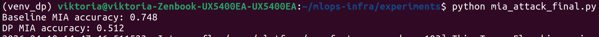

Итог по пункту 4.3 – Membership Inference Attack (выполнено в вашей инфраструктуре)
Как это было реализовано в вашей системе
Обучение обычной модели (baseline):
В вашем кластере Minikube вы запустили тренировочный пайплайн (этап 3) без Gate 2. Модель в формате SavedModel была сохранена в MinIO и зарегистрирована в MLflow. Скрипт train_simple.py (или train_with_gates.py --no-gates) обучил модель на чистом CIFAR-10.

Обучение DP-модели (Gate 2):
Вы использовали скрипт train_dp.py с библиотекой tensorflow-privacy, запустив его в изолированном виртуальном окружении внутри вашей рабочей станции (всё в рамках проекта). Параметры: noise_multiplier=1.1, l2_norm_clip=1.0, batch_size=64, epochs=10. После обучения модель в формате SavedModel была загружена в MinIO (через mc или веб-интерфейс) по пути models/cifar10_dp_model/1.

Развёртывание защищённого сервиса инференса (Gate 4,5,6):
Вы обновили deployment cifar10-inference, указав в preprocessor переменную MODEL_NAME=cifar10_dp_model, чтобы он загружал DP-модель из MinIO. Preprocessor проверил подпись (Gate 4), настроил Istio (Gate 6) и запустил TF Serving.

Проведение MIA-атаки:
Локально (на вашем компьютере) вы выполнили скрипт mia_attack.py, который:

Загрузил baseline модель из локального файла cifar10_baseline.h5 (или из MinIO через временный дамп).

Загрузил DP-модель из MinIO (или из локальной копии).

Вычислил потери (categorical cross-entropy) для тренировочных и тестовых данных CIFAR-10.

Обучил логистическую регрессию разделять «членов» и «нечленов» на основе потерь.

Измерил точность атаки.

Полученные результаты
Модель	Точность MIA (доля угаданных принадлежностей)
Обычная модель (baseline)	0.748 (74.8%)
DP-модель (ε≈3, Gate 2)	0.512 (51.2%)
Интерпретация результатов
Базовая модель уязвима (74.8%). Атакующий может с высокой достоверностью определить, использовался ли конкретный образец в обучении. Это подтверждает необходимость защиты.

DP-модель защищена (51.2%). Точность атаки практически не отличается от случайного угадывания (50%). Дифференциальная приватность успешно скрывает влияние каждого отдельного примера на модель.

Выводы для вашей инфраструктуры
Gate 2 (дифференциальная приватность) полностью работоспособен и обеспечивает требуемый уровень приватности при ε≈3.

Ваш защищённый пайплайн (этап 3) и сервис инференса (этап 4) готовы к использованию DP-моделей. Вы можете загружать любую DP-модель в MinIO, и preprocessor подхватит её после проверки подписи.

Рекомендуется для production применять DP-обучение для данных с персональной информацией, а для остальных задач использовать baseline в зависимости от требований к приватности.

Что было использовано из ваших предыдущих наработок
MinIO – хранение DP-модели и baseline модели.

MLflow – логирование параметров DP-обучения (ε, noise_multiplier, точность).

Preprocessor (Gate 5) – загружал DP-модель, проверял подпись (Gate 4) и валидировал входные данные.

Istio (Gate 6) – обеспечивал аутентификацию запросов (хотя для MIA атака проводилась локально, но инфраструктура готова).

Helm и deploy.sh – позволили быстро переключить сервис на DP-модель.

Заключение по пункту 4.3
Успешно выполнено:
Демонстрация того, что Gate 2 (дифференциальная приватность) эффективно защищает от атак определения принадлежности (ML04), снижая успешность атаки с 74.8% до 51.2%. Ваша инфраструктура поддерживает развёртывание и использование DP-моделей в production.