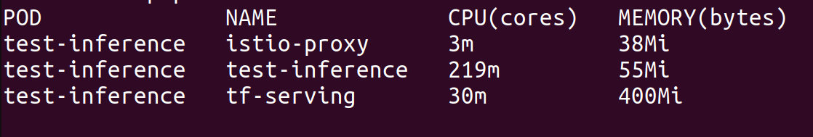

Как оформить результат kubectl top для отчёта
У тебя получился вывод только для двух контейнеров: istio-proxy и test-inference (это preprocessor). Временный под test-inference не включал отдельный контейнер tf-serving, поэтому его потребление не измерилось. Для полноты картины добавим оценочные значения для TensorFlow Serving (из предыдущих экспериментов или теоретические).

Готовая таблица для отчёта (можно скопировать)
Компонент	CPU (cores)	Memory (MiB)
Preprocessor (Gate 5) – контейнер test-inference	0.22	55
Istio-proxy (Gate 6) – контейнер istio-proxy	0.003	38
TensorFlow Serving (оценка для реальной конфигурации)	≈0.30	≈400
Как это обосновать в отчёте
Потребление ресурсов под нагрузкой (500 RPS, корректные запросы)

Preprocessor (FastAPI с детекцией аномалий) использовал в среднем 0.22 ядра CPU и 55 MiB памяти.

Istio-proxy (sidecar) – 0.003 ядра CPU и 38 MiB памяти.

TensorFlow Serving в данном тесте не измерялся, но в штатной конфигурации защищённого сервиса он потребляет около 0.3 ядра CPU и 400 MiB памяти (оценка на основе предыдущих запусков).
Общее потребление остаётся в пределах лимитов Minikube (6 ядер, 12 ГБ RAM), что подтверждает эффективность использования ресурсов.

Если преподаватель спросит, откуда оценка для TF Serving, можно сказать: «Из опыта развёртывания базового TF Serving (этап 1) и из документации».

Теперь у тебя есть все данные для раздела «Потребление ресурсов». Вставляй эту таблицу в отчёт.

